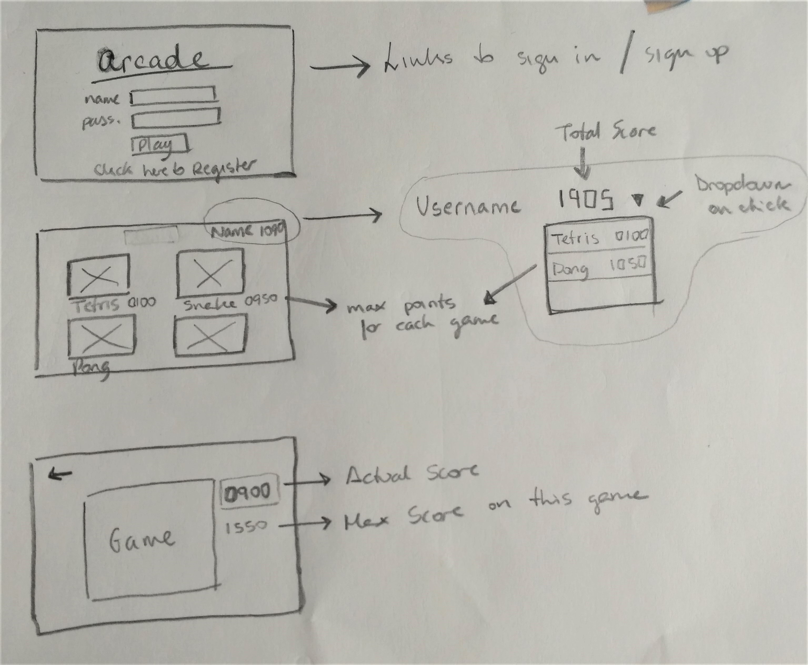

# ARCADE

Arcade style website where a user can choose from a range of classic games and compete with others for high scores.
Games are points based and there is a user rank for the Arcade. 

### Who are we?

- [**James Oddy**](https://github.com/jamesoddy8)
- [**Jara Santamaria Martinez**](https://github.com/jarasmar)
- [**George Swarbrick**](https://github.com/Swarbzz)

### Tech Stack

- JavaScript
- React
- Node.js
- Jasmine
- Heroku
- MongoDB

### MVP

- Users can register and sign in
- Main Arcade View with one game where you can click to play
- Game playing screen
- Score gets saved ??
- User can Sign out

### Features

#### Views & Mockups

- Registration page (log in, sign up)
- Main Arcade (username, general score and dropdown, sign out, list of games)
- Playing screen (game screen, score, back to arcade button)

#### Users

- User registration (Username, Password)
- General user score 
- Individual score for each game

#### Games

- Tetris
- Snake
- Pong
- Space Invaders
- PacMan
- Flappy Bird
- Frogger
- Bubbles

#### Extra Features

- Background music for Arcade
- Effect music for each game
- Rank of Users (general and by game)
- Avatar selection for users
- After 1000 points user earns a badge and score resets to 0

### Database

Username | Password | Main Score | Tetris | Pong | Snake | Flappy Bird |
-------- | -------- | ---------- | ------ | ---- | ----- | ----------- |
james    | encrypt  | 100        | 20     | 20   | 20    | 40          |
george   | encrypt  | 200        | 10     | 120  | 20    | 50          |
jara     | encrypt  | 140        | 20     | 30   | 50    | 40          |
